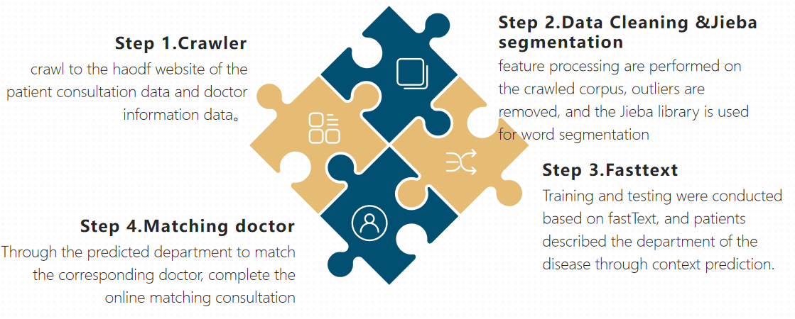
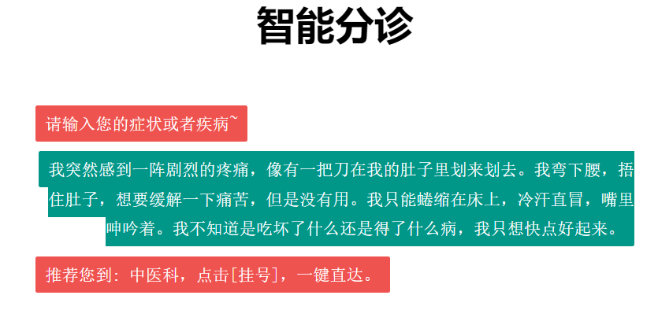
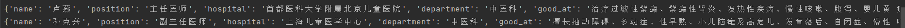

<!-- Improved compatibility of back to top link: See: https://github.com/othneildrew/Best-README-Template/pull/73 -->
<a name="readme-top"></a>
<!--
*** Thanks for checking out the Best-README-Template. If you have a suggestion
*** that would make this better, please fork the repo and create a pull request
*** or simply open an issue with the tag "enhancement".
*** Don't forget to give the project a star!
*** Thanks again! Now go create something AMAZING! :D
-->


<!-- PROJECT SHIELDS -->
<!--
*** I'm using markdown "reference style" links for readability.
*** Reference links are enclosed in brackets [ ] instead of parentheses ( ).
*** See the bottom of this document for the declaration of the reference variables
*** for contributors-url, forks-url, etc. This is an optional, concise syntax you may use.
*** https://www.markdownguide.org/basic-syntax/#reference-style-links
-->
[![Contributors][contributors-shield]][contributors-url]
[![Forks][forks-shield]][forks-url]
[![Stargazers][stars-shield]][stars-url]
[![Issues][issues-shield]][issues-url]
[![LinkedIn][linkedin-shield]][linkedin-url]


<!-- PROJECT LOGO -->
<br />
<div align="center">
<h3 align="center">Medical Intelligent Guidance</h3>
  <p align="center">
    Conducting research on AI-driven intelligent triage technology, we establish an automated platform that enhances online medical consultation efficiency. This includes structuring data from specialized test reports and extracting relevant information from images, aiding doctors in decision-making. This innovation enables addressing a greater number of inquiries in the same time frame, ultimately boosting doctors' productivity.
    <br />
  </p>
</div>


<!-- TABLE OF CONTENTS -->
<details>
  <summary>Table of Contents</summary>
  <ol>
    <li>
      <a href="#about-the-project">About The Project</a>
      <ul>
        <li><a href="#built-with">Built With</a></li>
      </ul>
    </li>
    <li>
      <a href="#getting-started">Getting Started</a>
      <ul>
        <li><a href="#prerequisites">Prerequisites</a></li>
        <li><a href="#installation">Installation</a></li>
      </ul>
    </li>
    <li><a href="#usage">Usage</a></li>
    <li><a href="#roadmap">Roadmap</a></li>
    <li><a href="#contributing">Contributing</a></li>
    <li><a href="#license">License</a></li>
    <li><a href="#contact">Contact</a></li>
    <li><a href="#acknowledgments">Acknowledgments</a></li>
  </ol>
</details>


<!-- ABOUT THE PROJECT -->
## About The Project

<p align="right">(<a href="#readme-top">back to top</a>)</p>


<!-- GETTING STARTED -->
## Getting Started
### Installation
python version > 3.6
1. Clone the repo
   ```sh
   git clone https://github.com/fqt111/Intelligent-safe-driving-detection-system.git
   ```
3. Install requirement packages
   ```sh
   pip install -r requirements.txt
   ```

### Crawler
1. use crawler.py to crawl the data from haodf website
   ```sh
   cd crawler
   python crawler.py
   ```
2. After getting haodaifu_data.csv, then do data cleaning which will get train.txt and dev.txt
   ```sh
   python data.py
   ```

### Fasttest
train using fasttest, which will get model.bin file storing model parameter
   ```sh
   cd model
   python train.py
   ```
<p align="right">(<a href="#readme-top">back to top</a>)</p>

### Flask interface

   ```sh
   python app.py run
   ```
The user enters the condition description in text format, and give the matching department though medical description


Through the predicted department to match the corresponding doctor, complete the online matching consultation



<!-- CONTACT -->
## Contact

Feng Qingtian - feng_qingtian@u.nus.edu

Project Link: [https://github.com/fqt111/Medical_Intelligent_Guidance](https://github.com/fqt111/Medical_Intelligent_Guidance)

<p align="right">(<a href="#readme-top">back to top</a>)</p>


<!-- ACKNOWLEDGMENTS -->
## Acknowledgments

* Lu Xinyu
* Tao Shihao
* Wang Yifan
* Wang Haoyang

<p align="right">(<a href="#readme-top">back to top</a>)</p>


<!-- MARKDOWN LINKS & IMAGES -->
<!-- https://www.markdownguide.org/basic-syntax/#reference-style-links -->
[contributors-shield]: https://img.shields.io/github/contributors/fqt111/Medical_Intelligent_Guidance.svg?style=for-the-badge
[contributors-url]: https://github.com/fqt111/Medical_Intelligent_Guidance/graphs/contributors
[forks-shield]: https://img.shields.io/github/forks/fqt111/Medical_Intelligent_Guidance.svg?style=for-the-badge
[forks-url]: https://github.com/fqt111/Medical_Intelligent_Guidance/network/members
[stars-shield]: https://img.shields.io/github/stars/fqt111/Medical_Intelligent_Guidance.svg?style=for-the-badge
[stars-url]: https://github.com/fqt111/Medical_Intelligent_Guidance/stargazers
[issues-shield]: https://img.shields.io/github/issues/fqt111/Medical_Intelligent_Guidance.svg?style=for-the-badge
[issues-url]: https://github.com/fqt111/Medical_Intelligent_Guidance/issues
[license-shield]: https://img.shields.io/github/license/fqt111/Medical_Intelligent_Guidance.svg?style=for-the-badge
[license-url]: https://github.com/fqt111/Medical_Intelligent_Guidance/blob/master/LICENSE.txt
[linkedin-shield]: https://img.shields.io/badge/-LinkedIn-black.svg?style=for-the-badge&logo=linkedin&colorB=555
[linkedin-url]: https://www.linkedin.com/in/qingtian-feng-4b1055288/
